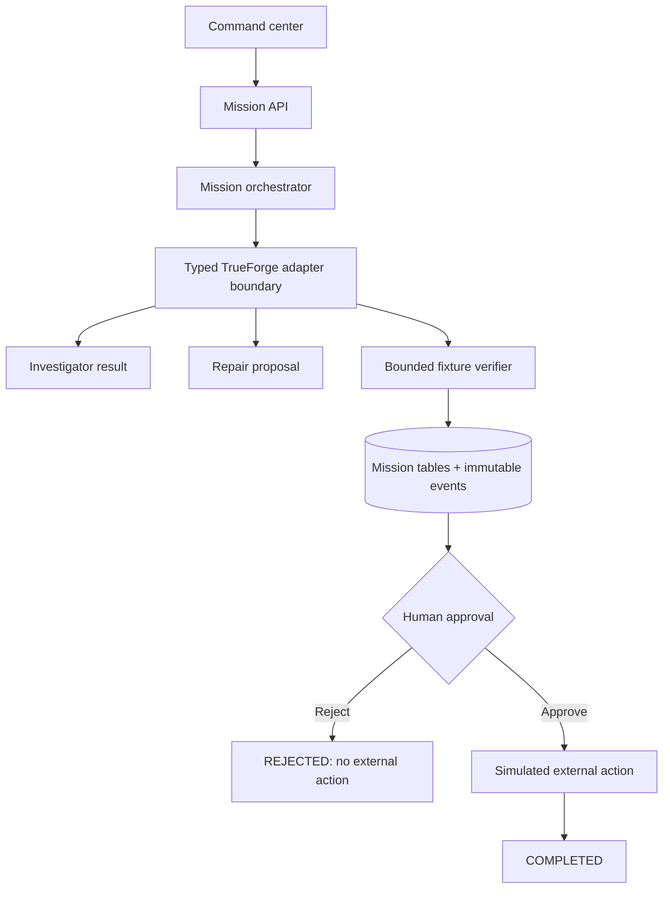

# SentinelForge

> **Investigate. Verify. Approve. Act.**

SentinelForge is an approval-gated engineering incident command center. It persists an incident mission, gathers deterministic fixture evidence, proposes a minimal repair, verifies that proposal through a bounded no-shell fixture adapter, and pauses for explicit human approval before recording a simulated external action.

## Problem and solution

Incident tools often either summarize a failure or move from diagnosis to a write without a durable human checkpoint. SentinelForge makes the decision boundary visible and captures evidence, repair, verification, approval, and outcome as append-only mission events.

## What works now

The demonstrator identifies a release-manifest version mismatch, proposes a one-file patch, verifies the known invariant without a shell or network request, persists a `WAITING_APPROVAL` checkpoint, and notifies the project owner. Approval records a **simulated** pull-request action only. No GitHub branch, commit, pull request, MCP write, or generated-code execution occurs.

## Why TrueForge

SentinelForge keeps future provider functionality behind a typed adapter. The intended production path is TrueForge sessions, GitHub MCP reads and writes, specialist subagents, provider sandboxing, approval pause/resume, and persistent context. The current UI exposes readiness honestly rather than claiming live access to tools.

## Architecture

## Quickstart and demo

Install dependencies with `pnpm install`, apply the generated database migration, and run `pnpm dev`. Choose **Run deterministic fixture**, review evidence and verification output, then either approve or decline the simulated external action. Inspect the append-only audit timeline and the integration-readiness panel.

## Safety and development

The current verifier runs no shell commands, generated code, network requests, or filesystem mutations. Mission IDs, approval state, and state transitions are validated server-side. A declined approval changes the mission to `REJECTED`, creates an audit event, and never creates an external action. Run `pnpm check` and `pnpm test` before every PR. See [SECURITY.md](./SECURITY.md) and [docs/TRUEFORGE_READINESS.md](./docs/TRUEFORGE_READINESS.md).

## Hackathon disclosure

SentinelForge was built as a new project for the Agent Harness Hackathon. Prior personal projects informed broad concepts such as evidence-first safety and approval boundaries, but no prior application source code, schemas, models, prompts, graphs, workflow engines, UI, migrations, fixtures, artifacts, histories, credentials, or private data were used as a foundation.
